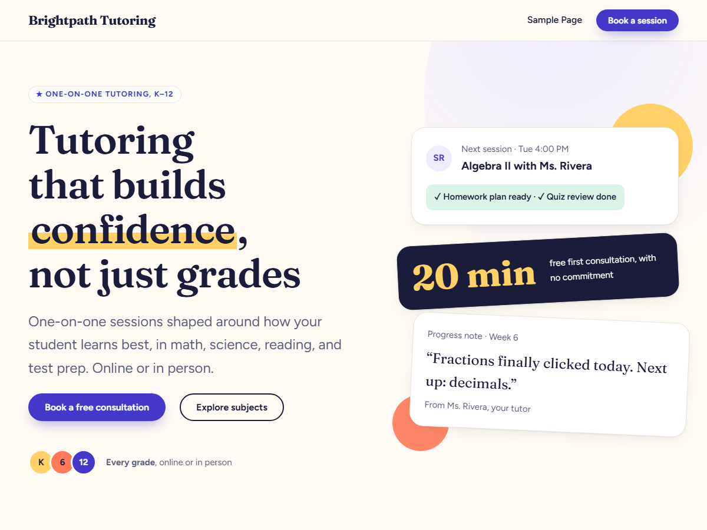

# Lessonlark

A warm, modern WordPress block theme for tutors and tutoring businesses, with a built-in "Book a session" form.



- **A complete landing page out of the box:** hero, quick facts, subjects, how it works, reviews, FAQ, and booking, all as editable patterns.
- **Booking that works on day one:** the bundled Lessonlark Booking plugin adds a request form (emailed to you and saved under **Bookings** in wp-admin, with spam protection and a "Followed up" workflow) and a Cal.com / Calendly scheduler block.
- **Pages ready to go:** an About page starter, a photo-ready hero, and a "Page without title" template.
- **Contact details in one place:** enter your phone, email, and hours under **Appearance → Contact details** and every spot that shows them updates, links included.
- **Your brand, quickly:** three color variations (Default, Meadow, Berry), bundled Fraunces and Figtree fonts, and every color, font, and spacing value editable under **Appearance → Editor → Styles**.
- **Automatic updates** from this repository's releases, like themes from WordPress.org.

Requires WordPress 6.6+ and PHP 7.4+.

## Install

1. Download `lessonlark.zip` from the [latest release](https://github.com/MathisWP/lessonlark/releases/latest). (Use that file, not GitHub's "Source code" download.)
2. In wp-admin, go to **Appearance → Themes → Add New Theme → Upload Theme**, choose the zip, and activate it.
3. On the Dashboard, click **Install & activate** in the Lessonlark notice to turn on the booking form.

## Development

Requires Docker and Node.

```sh
npm install
npm start          # http://localhost:8888, login admin / password
npm run stop
```

The theme is mounted into the local site as `lessonlark`, and the bundled plugin as `lessonlark-booking`, so edits show up on refresh.

| Path | What's there |
|---|---|
| `theme.json`, `styles/` | Design tokens and the color variations |
| `templates/`, `parts/` | Page templates, header and footer |
| `patterns/` | Every section of the site; `hidden-*` patterns hold template text so it can be translated |
| `inc/` | Shared pattern parts, the bundled-plugin installer, and the update checker |
| `plugins/lessonlark-booking/` | The bundled booking plugin |

## Releasing

1. Bump `Version:` in `style.css` and `Stable tag:` in `readme.txt`, and add a changelog entry to `readme.txt`. If the plugin changed, bump its version too (`plugins/lessonlark-booking/lessonlark-booking.php` and its `readme.txt`).
2. Commit and push.
3. Tag the release and push the tag:

   ```sh
   git tag v0.2.1
   git push origin v0.2.1
   ```

The [Release workflow](.github/workflows/release.yml) checks that the tag matches `style.css`, builds `lessonlark.zip`, and publishes the GitHub release. Sites running Lessonlark then see the update in wp-admin. Edit the release notes on GitHub if you like; they're shown in WordPress's "View version details" link.

The repository must be public for sites to see releases.

## License

[GPLv2 or later](LICENSE). Fraunces and Figtree are under the SIL Open Font License 1.1 (see `assets/fonts/`). The bundled [Plugin Update Checker](https://github.com/YahnisElsts/plugin-update-checker) library is MIT-licensed.
